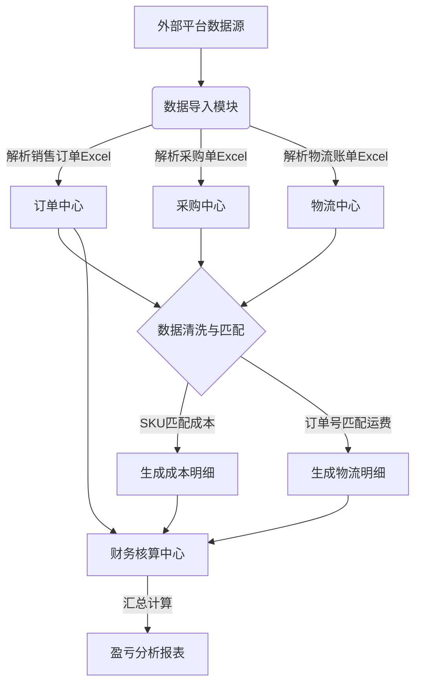

# 电商后台管理系统 - 业务流程文档

## 1. 核心业务流程图 (Core Business Flow)

系统以 **盈亏分析** 为最终目标，业务流转逻辑如下：

## 2. 详细流程说明

### 2.1 销售订单处理 (Sales Order Processing)
1.  **运营人员** 从 Amazon/Shopee 后台导出时间段内的《销售订单明细》Excel。
2.  在系统点击「上传订单」，选择对应平台模板。
3.  系统读取 Excel，提取 **订单号、SKU、销售额、佣金** 等字段。
4.  系统检查 SKU 是否存在：
    *   **存在**：直接关联。
    *   **不存在**：自动创建新 SKU 记录，标记为“待补全成本信息”。
5.  数据存入 `biz_orders` 表。

### 2.2 采购成本匹配 (Purchase Cost Matching)
1.  **采购人员** 上传《采购明细》Excel。
2.  系统提取 **采购单号、SKU、采购单价、供应商**。
3.  系统根据 **先进先出 (FIFO)** 或 **加权平均法** 计算该 SKU 的当前成本价。
4.  更新 `biz_products` 表中的 `avg_cost` (平均成本) 字段。
5.  **回填成本**：系统根据订单中的 SKU，找到对应的采购成本，回填至订单成本字段。

### 2.3 物流费用对账 (Logistics Reconciliation)
1.  **仓库/财务** 上传货代提供的《物流对账单》Excel。
2.  系统提取 **运单号 (Tracking Number)、费用、重量**。
3.  系统通通过 **运单号** 关联到具体的 **订单**。
    *   *注意*：如果一个订单拆分多个包裹，需支持多条物流记录对应一个订单。
4.  将物流费用回填至订单的 `shipping_cost` 字段。

### 2.4 盈亏计算 (P&L Calculation)
触发计算任务（可实时或定时）：
1.  遍历指定时间段内的所有订单。
2.  **公式执行**：
    *   `Gross Profit (毛利)` = `Sales Amount` - `Platform Fee` - `Purchase Cost` - `Logistics Cost`
3.  生成每日/每月盈亏报表，展示在仪表盘。

## 3. 异常处理流程
*   **SKU 不匹配**：导入订单时，若 SKU 在系统中找不到对应的采购记录（无成本价），系统将该订单标记为 **"成本缺失"**，并在首页提醒财务人员手动补录成本。
*   **物流未关联**：导入物流单时，若运单号匹配不到订单，标记为 **"异常运单"**，需人工核查（可能是补发单或运单号录入错误）。
