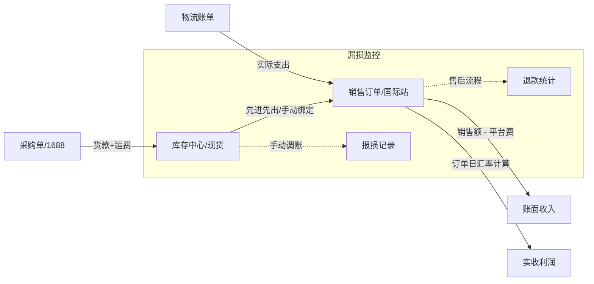

# 业务增长“财务闭环”深度分析与蓝图

要实现“成本、销售、盈利”的精准统计，系统必须形成一个闭环。目前我们已经有了销售、采购和物流的基础，但要达到“财务级”准确度，以下是深度思考后的补足计划：

## 1. 现状数据链条 (Current Status)
*   **收入**：阿里巴巴国际站导出（准确，含订单额、运费收入）。
*   **支出A（物流）**：物流商账单导出（准确，按平台单号匹配）。
*   **支出B（货值）**：**【当前薄弱点】** 依赖最新采购价或手动关联，无法处理“库存老货”与“新采购货”的成本差异。

## 2. 补漏建议：实现 100% 财务闭环

### A. 采购成本的“加权平摊” (Inbound Cost Allocation)
*   **方案**：在采购单入库时，支持将“采购运费”按数量平摊到 SKU 上，生成**真实入库价**。

### B. 平台交易费率 (Platform Transaction Fees)
*   **方案**：系统配置中增加“平台手续费率”。利润计算公式升级为：
    > **扣费利润 = 销售额 × (1 - 平台费率) - 货品入库成本 - 实际物流支出**

### C. 损耗与盘点 (Loss & Adjustment)
*   **方案**：新增“库存报损”功能。允许手动调减库存并记录原因（如“样品损耗”、“破损”），这部分金额计入“非订单运营支出”。

### D. 退款与逆向物流 (Refund & Return)
*   **方案**：标记“已退款”订单。区分“全额退款无货回”和“退货入库”两种场景，精确统计真实损益。

### E. 动态汇率同步 (Dynamic Exchange Rate)
*   **方案**：**按订单日汇率计算**。系统在计算多币种利润时，自动抓取或匹配订单生成当天的汇率，确保财务数据的时效性和准确性。

## 3. 闭环模型总结预览

---
> [!IMPORTANT]
> **实施目标**：通过这套蓝图，系统将不再仅仅是记录数据的工具，而是能够自动输出“亏钱还是赚钱”结论的经营辅助系统。
