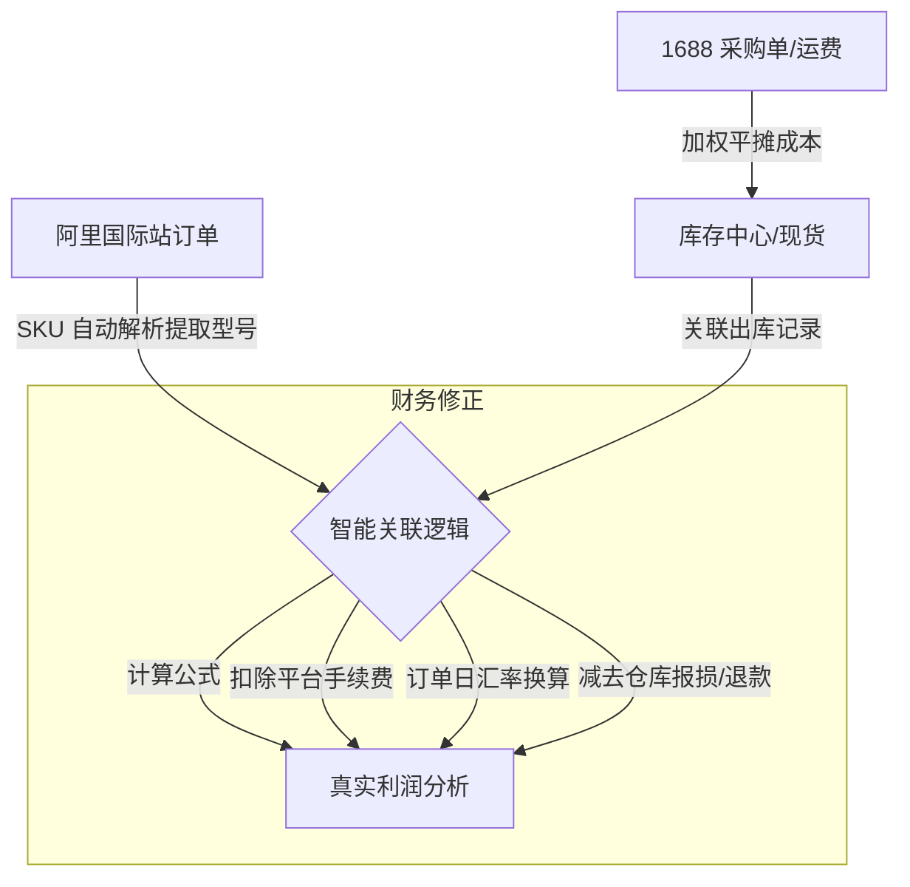

# 系统升级优化方案：库存、SKU 解析与财务闭环

## 1. 核心目标
将系统从单一的“订单记录器”升级为具备**库存追溯能力**和**真实财务闭环**的经营助手。解决采购、库存、销售三方数据脱节的问题。

---

## 2. 核心模块方案

### A. 智能库存管理 (Stock Management)
*   **现货看板**：按“型号+规格”展示实时库存。
*   **出库全追溯 (Traceability)**：每一笔库存扣减（发货）均自动生成记录，可查看到具体被哪个订单消耗。
*   **库存预警**：库存低于设定值时自动提醒补货。
*   **手动报损**：记录仓库破损、样品消耗等非订单支出。

### B. 智能 SKU 规格解析 (Smart SKU Parsing)
*   **算法提炼**：系统自动从阿里国际站的 SKU 规格字符串（如 `Color:Black-B002,Length:20cm`）中提取出型号 `B002` 和对应长度。
*   **免除映射**：只要库存录入的型号与销售 SKU 中的一致，系统自动实现“单货关联”，省去维护映射字典的麻烦。

### C. 财务闭环与利润统计 (Financial Closed-Loop)
*   **真实成本核算**：采购成本将包含“货值 + 分摊运费”，计算出最真实的**落地成本**。
*   **平台费用扣除**：支持设置“平台费率”，在计算利润时自动扣除交易手续费和佣金。
*   **订单日汇率**：系统根据**订单下单日期**自动匹配历史汇率，确保多币种转 CNY 的利润准确无误。
*   **退款损益**：记录退款订单及其是否退货入库，精准核算售后损益。

---

## 3. 技术实施蓝图

---
> [!IMPORTANT]
> **结论**：通过实施该方案，您将获得一套能够自动输出“公司实收净利润”的系统，彻底告别 Excel 手动对账。
